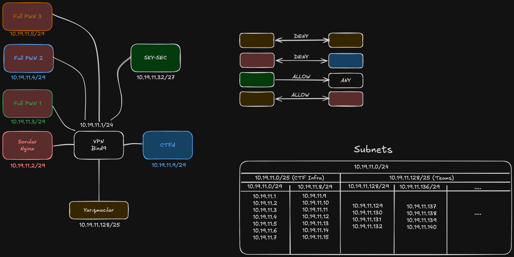

# SKYDAYS-CTF 26

## Crypto

- [Nihilist Penguin](crypto/Nihilist%20Penguin)

## Forensics

- [easy-pcap-nine-nine](forensics/easy-pcap-nine-nine)
- [medium-pcap-nine-nine](forensics/medium-pcap-nine-nine)

## MISC

- [FileVault](misc/FileVault)
- [misc-fe-enc](misc/misc-fe-enc)
- [skysec-inventory](misc/skysec-inventory)

## OSINT

- [open-up!](osint/open-up%21)

## PWN

- [mertcan-meown](pwn/mertcan-meown)
- [norop](pwn/norop)
- [whatlibc](pwn/whatlibc)

## Reverse

- [amd-my-password-vault](reverse/amd-my-password-vault)
- [huffman](reverse/huffman)
- [pasli_demir](reverse/pasli_demir)
- [serial-hook](reverse/serial-hook)

## Stego

- [angry_teacher](stego/angry_teacher)

## WEB

- [CloudOps-Breach](web/CloudOps-Breach)
- [amd-recon-ctf](web/amd-recon-ctf)
- [order-66](web/order-66)

## Windows
- [Mirage-FullPwn](Windows/Mirage-Fullpwn)

