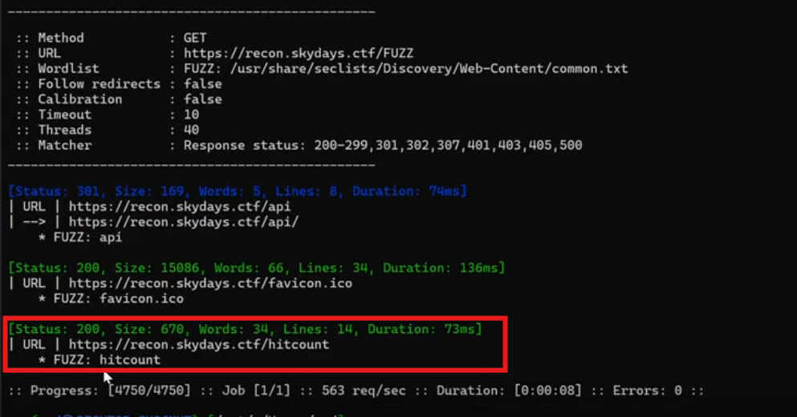
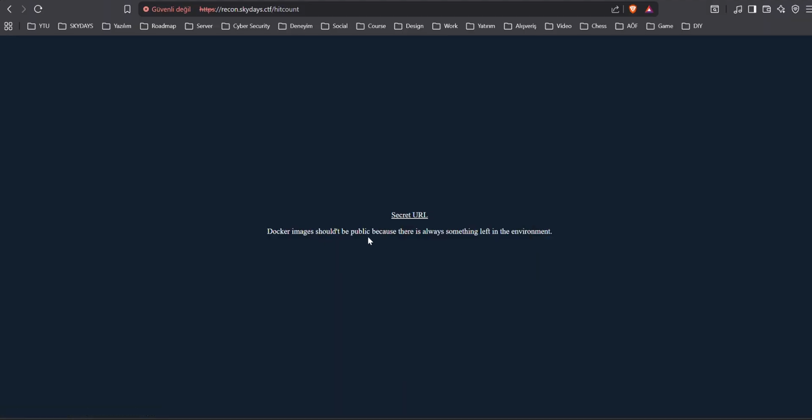
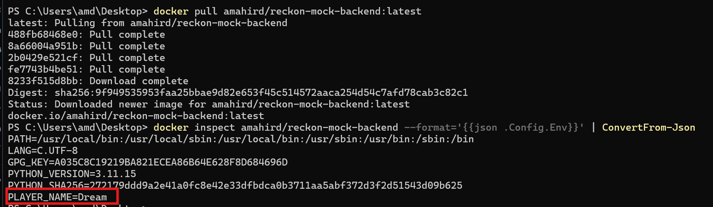
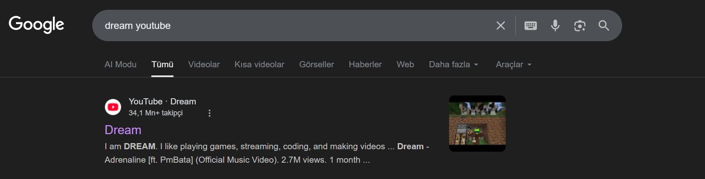
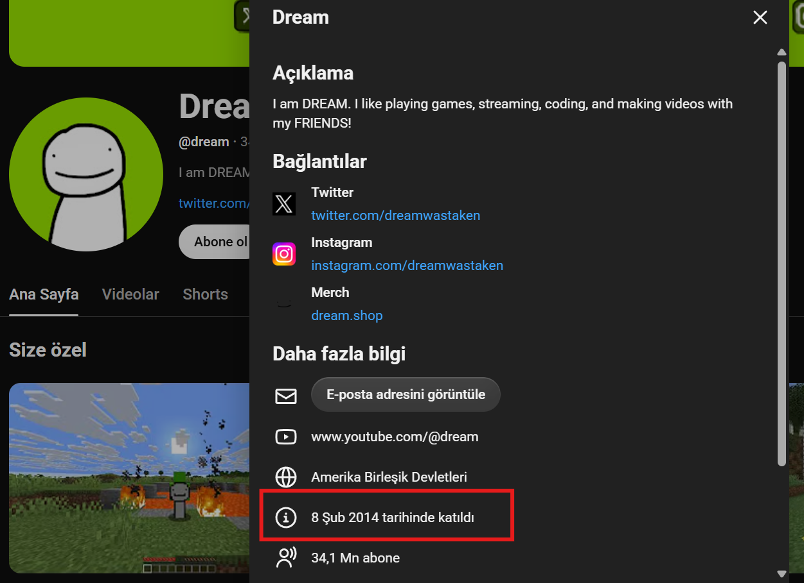
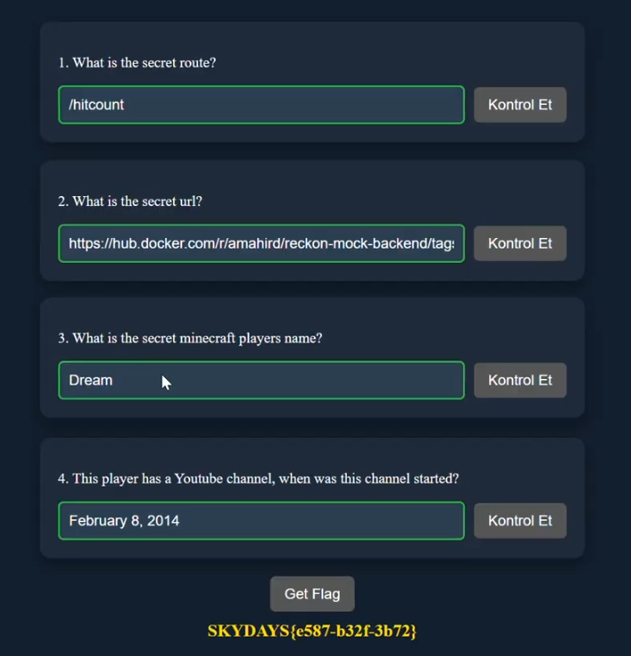

# Recon

**Kategori:** Web

**Zorluk:** Easy

---

## Çözüm

1. **What is the secret route?:**
   
   ```text
   Gizli yolu bulmak için ffuf kullanabiliriz.
   ```
   
   ```sh
   ffuf -w /usr/share/seclists/Discovery/Web-Content/common.txt -u https://recon.skydays.ctf/FUZZ -c -v
   ```

   

2. **What is the secret url?:**
   
   ```text
   https://recon.skydays.ctf/hitcount sayfasını ziyaret ederek url'e ulaşabiliriz.
   ```

   

3. **What is the secret minecraft players name?:**
   
   ```text
   Secret url'in bir docker image olduğunu görüyoruz. /hitcount sayfasında da her zaman enviroment'da bir şey kalır diye ipucu var.
   ```

   ```sh
   docker pull amahird/reckon-mock-backend:latest
   docker inspect amahird/reckon-mock-backend --format='{{json .Config.Env}}' | ConvertFrom-Json
   ```

   

4. **This player has a Youtube channel, when was this channel started?:**
  
   

   

5. **Flag'i Al:**
  
   
